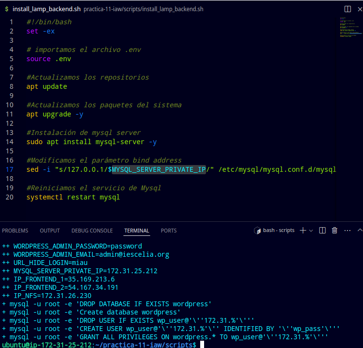
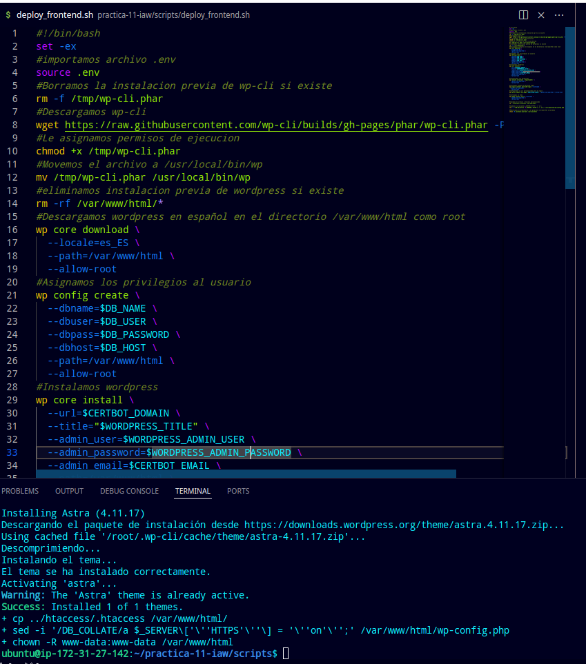
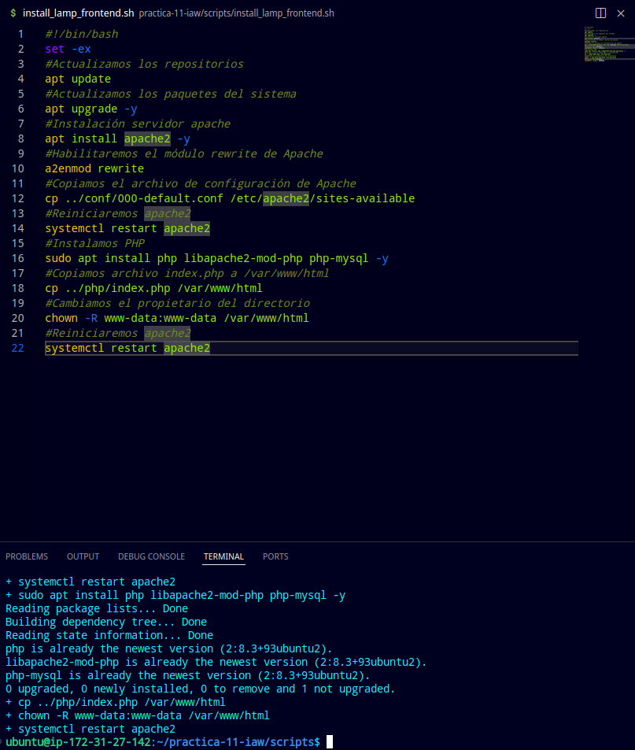
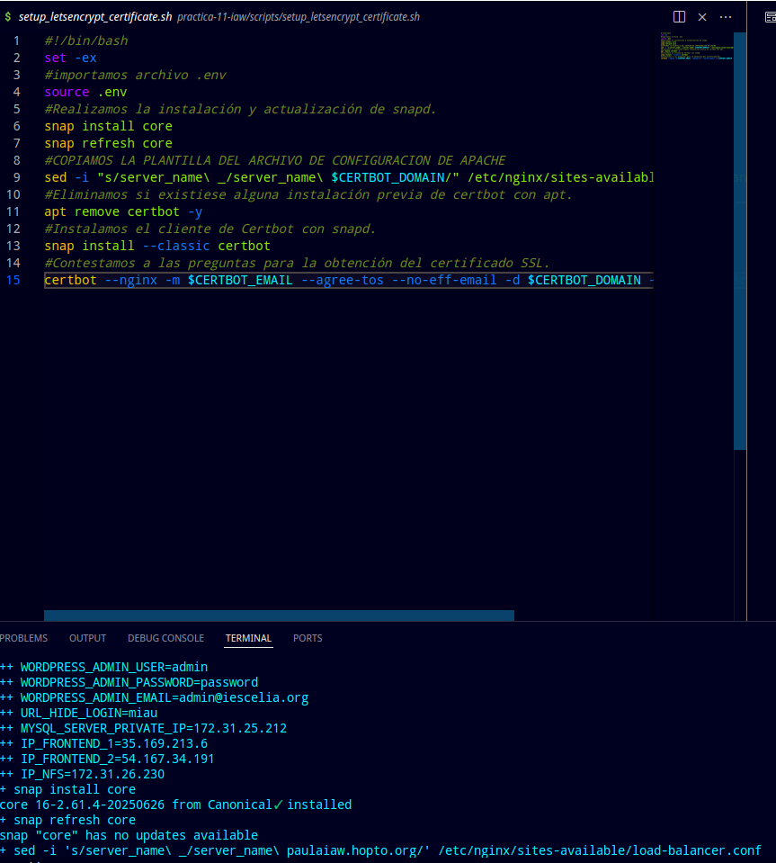
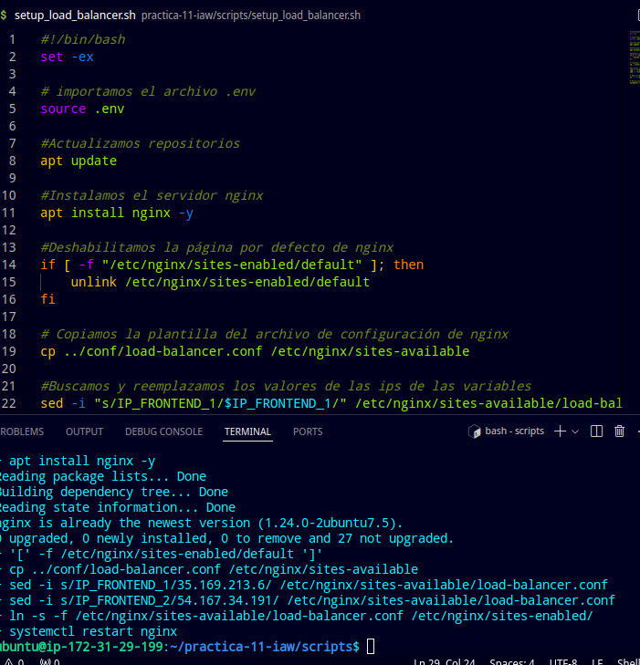
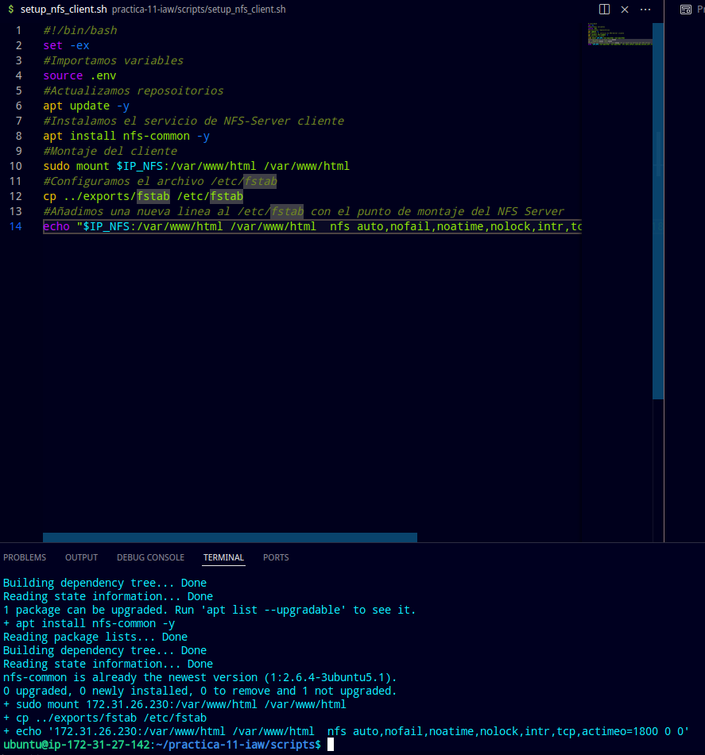
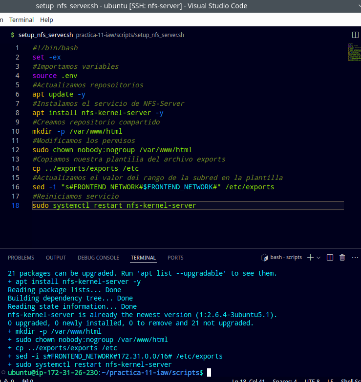

# practica-11-iaw
practica 11
# Configuramos el deploy_backend.sh
## #!/bin/bash
set -ex

## importamos el archivo .env
source .env

## Creamos base de datos
mysql -u root -e "DROP DATABASE IF EXISTS $DB_NAME"
mysql -u root -e "Create database $DB_NAME"

## Creamos un usuario y contraseña para la base de datos
mysql -u root -e "DROP USER IF EXISTS $DB_USER@'$IP_CLIENTE_MYSQL'"
mysql -u root -e "CREATE USER $DB_USER@'$IP_CLIENTE_MYSQL' IDENTIFIED BY '$DB_PASSWORD'"
## asignamos permisos
mysql -u root -e "GRANT ALL PRIVILEGES ON $DB_NAME.* TO $DB_USER@'$IP_CLIENTE_MYSQL'"

# Configuramos el deploy_frontend.sh
## #!/bin/bash
set -ex
## importamos archivo .env
source .env
## Borramos la instalacion previa de wp-cli si existe
rm -f /tmp/wp-cli.phar
##Descargamos wp-cli
wget https://raw.githubusercontent.com/wp-cli/builds/gh-pages/phar/wp-cli.phar -P /tmp
## Le asignamos permisos de ejecucion
chmod +x /tmp/wp-cli.phar
## Movemos el archivo a /usr/local/bin/wp
mv /tmp/wp-cli.phar /usr/local/bin/wp
## eliminamos instalacion previa de wordpress si existe
rm -rf /var/www/html/*
## Descargamos wordpress en español en el directorio /var/www/html como root
wp core download \
  --locale=es_ES \
  --path=/var/www/html \
  --allow-root
## Asignamos los privilegios al usuario
wp config create \
  --dbname=$DB_NAME \
  --dbuser=$DB_USER \
  --dbpass=$DB_PASSWORD \
  --dbhost=$DB_HOST \
  --path=/var/www/html \
  --allow-root
## Instalamos wordpress
wp core install \
  --url=$CERTBOT_DOMAIN \
  --title="$WORDPRESS_TITLE" \
  --admin_user=$WORDPRESS_ADMIN_USER \
  --admin_password=$WORDPRESS_ADMIN_PASSWORD \
  --admin_email=$CERTBOT_EMAIL \
  --path=/var/www/html \
  --allow-root  

## Configuramos los permalinks
wp rewrite structure '/%postname%/' \
  --path=/var/www/html \
  --allow-root

## Instalamos plugin de WPS Hide Login
wp plugin install wps-hide-login --activate \
 --path=/var/www/html \
  --allow-root
## Configuramos la url personalizada para el login
wp option update whl_page "$URL_HIDE_LOGIN" --path=/var/www/html --allow-root

## Instalamos un tema
wp theme install astra --activate \
  --path=/var/www/html \
  --allow-root

## Copiamos el archivo .htaccess personalizado
cp ../htaccess/.htaccess /var/www/html/

## Añadimos la variable $_SERVER['HTTPS'] = 'on';
sed -i "/DB_COLLATE/a \$_SERVER\['HTTPS'\] = 'on';" /var/www/html/wp-config.php

## Modificamos el propietario y el grupo de /var/www/html a www-data
chown -R www-data:www-data /var/www/html

# Configuramos el install_lamp_backend.sh
## #!/bin/bash
set -ex

## importamos el archivo .env
source .env

## Actualizamos los repositorios
apt update

## Actualizamos los paquetes del sistema
apt upgrade -y

## Instalación de mysql server
sudo apt install mysql-server -y

## Modificamos el parámetro bind address
sed -i "s/127.0.0.1/$MYSQL_SERVER_PRIVATE_IP/" /etc/mysql/mysql.conf.d/mysqld.cnf

## Reiniciamos el servicio de Mysql
systemctl restart mysql

# Configuramos el install_lamp_frontend.sh
## #!/bin/bash
set -ex
## Actualizamos los repositorios
apt update
## Actualizamos los paquetes del sistema
apt upgrade -y
## Instalación servidor apache
apt install apache2 -y
## Habilitaremos el módulo rewrite de Apache
a2enmod rewrite
## Copiamos el archivo de configuración de Apache
cp ../conf/000-default.conf /etc/apache2/sites-available
## Reiniciaremos apache2
systemctl restart apache2
## Instalamos PHP
sudo apt install php libapache2-mod-php php-mysql -y
## Copiamos archivo index.php a /var/www/html
cp ../php/index.php /var/www/html
## Cambiamos el propietario del directorio
chown -R www-data:www-data /var/www/html
## Reiniciaremos apache2
systemctl restart apache2

# Configuración setup_letsencrypt_certificate.sh
## #!/bin/bash
set -ex
## importamos archivo .env
source .env
## Realizamos la instalación y actualización de snapd.
snap install core
snap refresh core
## COPIAMOS LA PLANTILLA DEL ARCHIVO DE CONFIGURACION DE APACHE
sed -i "s/server_name\ _/server_name\ $CERTBOT_DOMAIN/" /etc/nginx/sites-available/load-balancer.conf
## Eliminamos si existiese alguna instalación previa de certbot con apt.
apt remove certbot -y
## Instalamos el cliente de Certbot con snapd.
snap install --classic certbot
## Contestamos a las preguntas para la obtención del certificado SSL.
certbot --nginx -m $CERTBOT_EMAIL --agree-tos --no-eff-email -d $CERTBOT_DOMAIN --non-interactive

# Creamos el setup_load_balancer.sh
## #!/bin/bash
set -ex

## importamos el archivo .env
source .env

## Actualizamos repositorios
apt update

## Instalamos el servidor nginx
apt install nginx -y

## Deshabilitamos la página por defecto de nginx
if [ -f "/etc/nginx/sites-enabled/default" ]; then
    unlink /etc/nginx/sites-enabled/default
fi

## Copiamos la plantilla del archivo de configuración de nginx
cp ../conf/load-balancer.conf /etc/nginx/sites-available

## Buscamos y reemplazamos los valores de las ips de las variables
sed -i "s/IP_FRONTEND_1/$IP_FRONTEND_1/" /etc/nginx/sites-available/load-balancer.conf
sed -i "s/IP_FRONTEND_2/$IP_FRONTEND_2/" /etc/nginx/sites-available/load-balancer.conf

## Habilitamos el sitio de load balancer
ln -s -f /etc/nginx/sites-available/load-balancer.conf /etc/nginx/sites-enabled/

## Reiniciamos el servicio de nginx para aplicar los cambios
systemctl restart nginx

# Configuramos el setup_nfs_client.sh
## #!/bin/bash
set -ex
## Importamos variables
source .env
## Actualizamos reposoitorios
apt update -y
## Instalamos el servicio de NFS-Server cliente
apt install nfs-common -y
## Montaje del cliente
sudo mount $IP_NFS:/var/www/html /var/www/html
## Configuramos el archivo /etc/fstab
cp ../exports/fstab /etc/fstab
## Añadimos una nueva linea al /etc/fstab con el punto de montaje del NFS Server
echo "$IP_NFS:/var/www/html /var/www/html  nfs auto,nofail,noatime,nolock,intr,tcp,actimeo=1800 0 0">> /etc/fstab

# Configuramos el setup_nfs_server.sh
## #!/bin/bash
set -ex
## Importamos variables
source .env
## Actualizamos reposoitorios
apt update -y
## Instalamos el servicio de NFS-Server
apt install nfs-kernel-server -y
## Creamos repositorio compartido
mkdir -p /var/www/html
## Modificamos los permisos
sudo chown nobody:nogroup /var/www/html
## Copiamos nuestra plantilla del archivo exports
cp ../exports/exports /etc
## Actualizamos el valor del rango de la subred en la plantilla
sed -i "s#FRONTEND_NETWORK#$FRONTEND_NETWORK#" /etc/exports
## Reiniciamos servicio
sudo systemctl restart nfs-kernel-server
